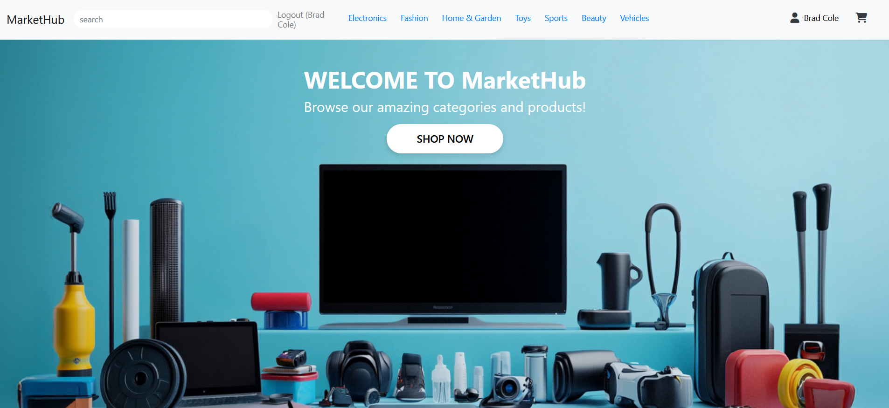
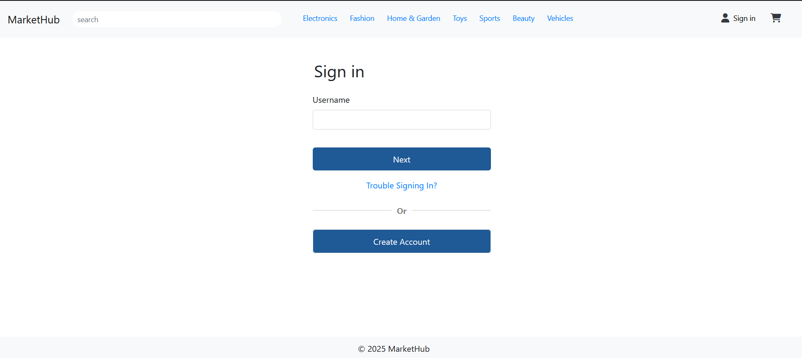
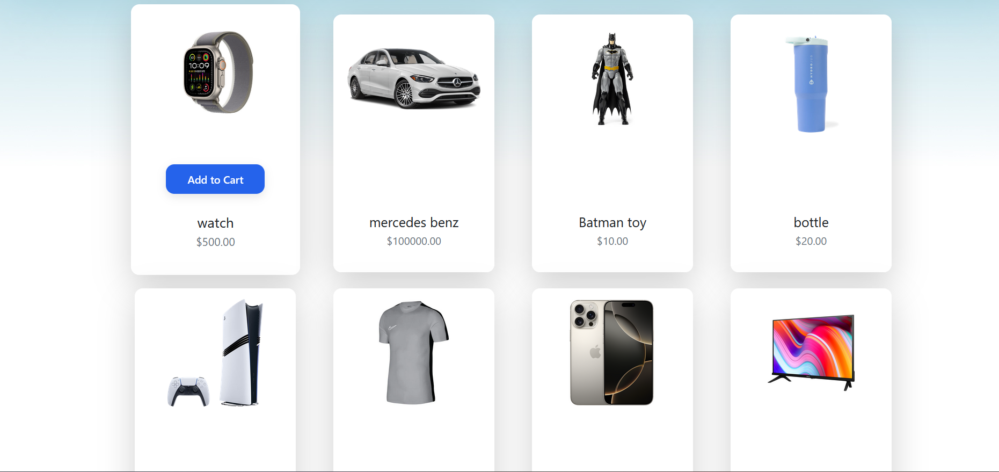
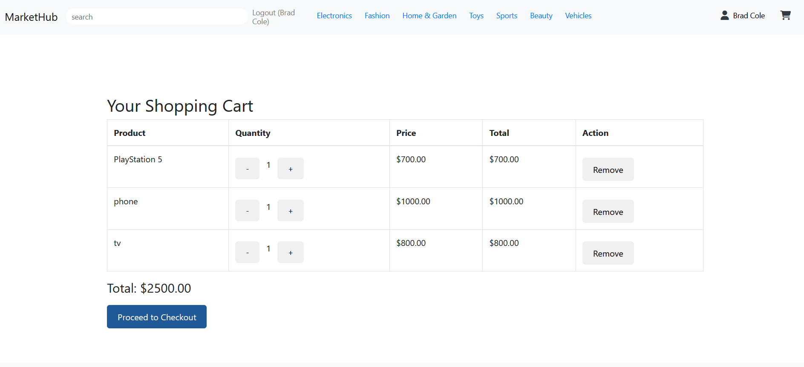
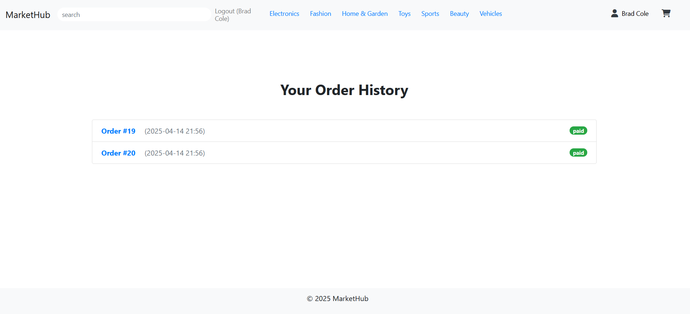
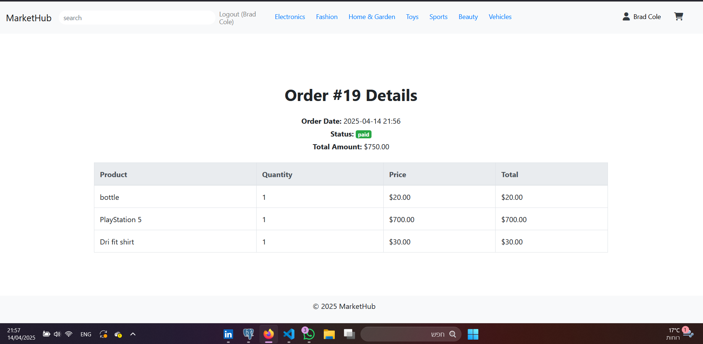

# MarketHub

## Overview
MarketHub is a full-stack e-commerce web application built using Flask. It enables customers to browse and purchase products across various categories while allowing suppliers to manage their inventory efficiently. The platform provides a seamless shopping experience, intuitive user interface, and robust backend logic.

---

## Preview

### Homepage  


### Login Page  


### Product Page  


### Checkout Flow  


### Order History Page


### Order Summery Page 



---


## Technologies Used
- Python 3.11
- Flask (Web framework)
- Jinja2 (Templating engine)
- SQLAlchemy (ORM)
- PostgreSQL (Relational database)
- Bootstrap 4 (UI components)
- JavaScript (Frontend interactivity)
- HTML/CSS

---

## Getting Started

### 1. Clone the Repository
```
git clone https://github.com/yourusername/MarketHub_PROJECT.git
```

### 2. Create a Virtual Environment
```
python -m venv venv
source venv/bin/activate     # On Windows: venv\Scripts\activate
```

### 3. Install Dependencies
```
pip install -r requirements.txt
```

### 4. Configure Environment Variables
Create a `.env` file in the root directory with the following keys:
```
SECRET_KEY=your_secret_key
DATABASE_URL=your_postgresql_database_url
```

### 5. Initialize the Database
```
python seed.py
python seed_subcategories.py
```

### 6. Run the Application
```
python app.py
```
Visit [http://127.0.0.1:5000](http://127.0.0.1:5000) in your browser to start using the application.

---

## Project Structure
```
MarketHub_PROJECT/
├── app.py                    # Main Flask application
├── models/                   # SQLAlchemy data models
├── db/                       # Database configuration
├── frontend/
│   ├── static/               # Static assets (CSS, JS, images)
│   └── templates/
│       ├── base.html         # Base template
│       ├── index.html        # Home page
│       ├── add_product.html  # Product addition form
│       └── partials/         # Reusable UI components
├── seed.py                   # Script to seed categories
├── seed_subcategories.py     # Script to seed subcategories
├── requirements.txt          # Python dependencies
└── README.md                 # Project documentation
```

---

## Core Features
- Role-based access: Supplier and Customer
- Secure authentication and session management
- Category and subcategory navigation
- Dynamic dropdowns for product classification
- Supplier product management dashboard
- Customer shopping cart and checkout system
- Real-time stock management and quantity controls
- Order history for both customers and suppliers
- Responsive UI with hover effects and form validation
- Hashed password storage using Werkzeug for secure authentication
- CSRF protection implemented via Flask-WTF forms


---

## Future Improvements

- Role-based permissions for advanced admin functionality
- REST API support for mobile or external integrations
- Enhanced search and filtering capabilities
- Real-time notifications for orders and status changes
- Multi-language support for broader accessibility
- Comprehensive test coverage and CI/CD integration


